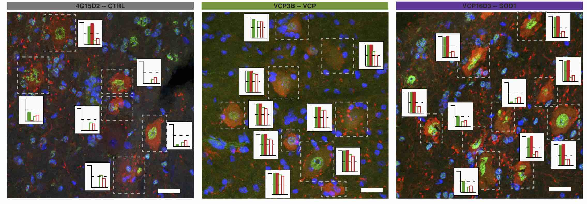

# ALSdisMNs
Automated and unbiased classification of motor neuron phenotypes with single cell resolution in ALS tissue.



## Overview
This repository contains source code to implement automated identification of MNs exhibiting aberrant phenotype from high-content microscopy data. It contains two Jupyter notebook allowing to reproduce the figures in manuscript *Automated and unbiased classification of motor neuron phenotypes with single cell resolution in ALS tissue*, Hageman et al. 2020 (BioRxiv). All data required to reproduce the manuscript can be download on [Zenodo](https://zenodo.org/record/3981414#.XzRMxqeB3OQ).

## Repository content
* [Data](http://doi.org/10.5281/zenodo.3985099): this folder should containing all raw data acquired from CellProfiler on multichanel fluorescent images segmented using the pipeline if one wants to replicate the work. All scripts as well as the raw images required to reproduce these can be downloaded from Zenodo together with the Data folder under the accession number [3985099](http://doi.org/10.5281/zenodo.3985099).
* [Scripts](./Scripts): Jupyter Notebook containing `R` and `Python` codes to automatically identify MNs subpopulation from the single-cell measurements data outputted by CellProfiler.
* [Figures](./Figures): raw figures as outputted by the analysis and used for the paper. 


## Dependencies

It is recommended to create a virtual environment to ensure complete reproducibility of the project, which relies on R (tested on R-3.3.1) and Python (tested on Python 3.5.3).

```R
install.packages(c('data.table', 'dplyr','knitr','chron','colortools','RColorBrewer','corrplot','geneplotter',
             'lme4','beeswarm','rlang','stargazer','viridis','mclust','ape','dendextend','wordcloud','reshape'))
```

Here is how to create a virtual environment called *env* 

1. If virtualenv is not installed, `python3 -m pip install --user -U virtualenv`
1. `cd $MY_PATH` where  `$MY_PATH` is the location of the repository
1. `virtualenv -p ``which python3`` env`
1. `source ./env/bin/activate`
1. `pip3 install --upgrade -r requirements.txt` 

The file `requirements.txt` contains all the Python librariries.


Then you can create and work as you would do normally. The next time 

1. `cd $MY_PATH`
1. `source ./env/bin/activate`


### To work on Jupyter Notebook remotely

On your remote  machine (access via SHH for example):

1. `cd $MY_PATH`
1. `source ./env/bin/activate` 
1. `jupyter notebook --no-browser --port=8786`

On your local machine:

1. `ssh -N -L localhost:8787:localhost:8886 <username@remote.com>`
1. Open your browser on the local machine and type in the address bar: `localhost:8787`


